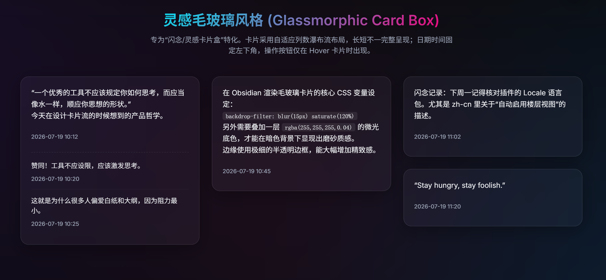
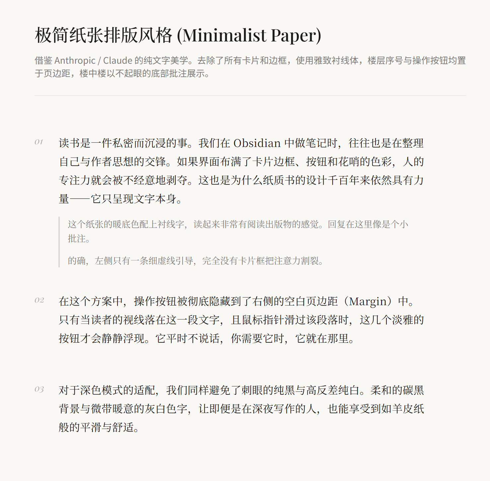
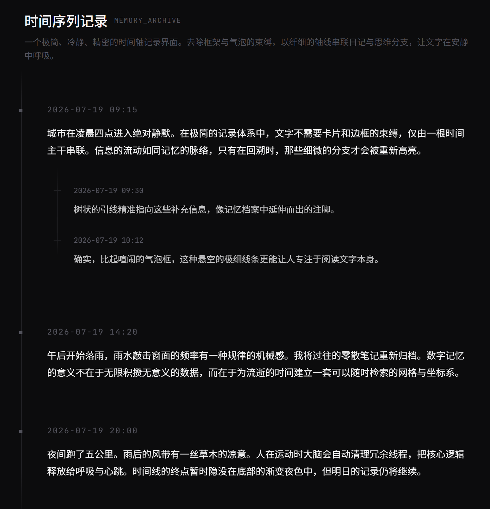

# Floor notes

[English README](README.md)

> 将普通 Markdown 笔记变成易读、可编辑的楼层讨论串，同时让每个楼层和回复继续以人类可读的 Markdown 保存在仓库中。

Floor notes 是一个面向 Obsidian 的论坛式笔记插件，适合项目讨论、决策记录、会议跟进、问答页面、研究日志以及任何会持续追加“楼层”和“回复”的内容。插件提供专用楼层视图、记录操作、收藏侧栏、四种展示布局、Markdown 编辑与预览，以及可配置的主题，但不会把内容搬进独立数据库或不可读的私有格式。

## 功能概览

- 将符合格式的 Markdown 笔记渲染为 **楼层 / 回复** 讨论串。
- 添加、编辑、删除、排序和收藏楼层；添加、编辑和删除回复。
- 在独立侧栏中查看所有笔记里的收藏楼层，点击可跳转回原始记录。
- 提供四种界面布局：**Bubble 气泡**、**Glass 毛玻璃**、**Paper 极简纸张**、**Timeline 时间轴**。
- 按普通 Markdown 渲染记录内容，支持标题、列表、链接、代码块、表格、引用和内部链接。
- 当回复已有的小写 `author` 与所属楼层不同时，按条件显示回复者署名。
- 在桌面楼层视图中拖动图片角标调整 Direct image 大小，并将宽度保存为 Obsidian 兼容 Markdown。
- 可选在楼层视图的图片下方显示作者提供的图片别名。
- 撰写时可在 **写作** 与 **预览** 之间切换；草稿会自动保存到本地，并可恢复或废弃。
- 跟随 Obsidian 主题，或选择 Nord、Monokai、VS Code、Material、Claude、Dracula、Gruvbox、Solarized 等内置配色。
- 内置配色支持自动、浅色和深色模式。

## 四种界面展示与介绍

当前布局会通过 `floor-notes-view-style` 写入笔记自身。设置页中的“默认帖子视图风格”用于新笔记或没有单独指定布局的笔记；楼层视图顶部的调色板按钮可以直接切换当前笔记的布局。

下面的截图来自仓库中对应的 demo 页面，用来展示四种布局的实际视觉效果。插件运行时的颜色、间距、字体和列数会随所选主题与当前窗格宽度自适应。

### 1. Bubble 气泡：论坛式分组卡片

每个楼层是一张圆角卡片，回复集中在楼层下方的子面板中，并通过分隔线与主楼层区分，能够直观看出“楼层—回复”的从属关系。


**适合：** 项目讨论、问答、问题记录和重视上下文分组的聊天式内容。

### 2. Glass 毛玻璃：响应式卡片网格

楼层组会变成半透明卡片，并根据窗格宽度排列为响应式网格。布局使用模糊背景网格和测量后的类瀑布流排列，让不同高度的卡片也能较紧凑地呈现。



**适合：** 总览页、灵感集合、视觉化仪表盘和包含很多独立楼层的笔记。

### 3. Paper 极简纸张：安静的文章栏

讨论串被收束为窄幅文章栏，使用衬线字体、悬挂式楼层编号、克制的元信息，并用竖线表示回复关系，适合长文阅读和归档。



**适合：** 会议纪要、文章、阅读笔记、决策记录和长期归档文档。

### 4. Timeline 时间轴：按时间排列的档案轴

楼层沿垂直时间轴排列，使用节点和回复刻度表达顺序；日期更突出，操作按钮贴近记录，并在悬停或获得焦点时显示得更清楚。



**适合：** 更新日志、研究轨迹、事件记录、进度日志和按时间书写的日记。

## 安装方法

### 使用要求

- Obsidian **1.8.7 或更高版本**。
- 需要开启社区插件。Obsidian 的受限模式会阻止第三方插件运行；请只安装和启用你信任的插件。
- 本插件不需要 API Key，也不依赖外部在线服务。

### 方式一：通过 Obsidian 插件市场安装

当 `Floor notes` 已经出现在官方社区插件目录中时，推荐使用此方式。

1. 打开 **设置 → 社区插件**。
2. 关闭受限模式；如果出现提示，选择 **开启社区插件**。
3. 点击 **浏览**，搜索 `Floor notes`。
4. 选择插件，点击 **安装**，然后点击 **启用**。
5. 进入 **设置 → 社区插件 → 已安装插件 → Floor notes** 查看插件选项。

如果搜索不到 `Floor notes`，说明当前仓库或版本还没有发布到官方社区目录，请改用 BRAT 或手动安装。

### 方式二：通过 BRAT 安装

[BRAT](https://github.com/TfTHacker/obsidian42-brat) 适合安装尚未进入社区目录的测试版或预发布版本。

1. 从社区插件市场安装并启用 **Obsidian42 - BRAT**。
2. 打开命令面板，运行 **BRAT: Add a beta plugin for testing**。部分 BRAT 版本会显示为 **BRAT: Plugins: Add a beta plugin for testing**。
3. 输入 Floor notes 的 GitHub 仓库地址，例如：

   ```text
   https://github.com/<owner>/<repository>
   ```

4. 点击 **Add Plugin**，等待 BRAT 下载并安装发布版本。
5. 返回 **设置 → 社区插件**；如有需要先刷新已安装插件列表，然后启用 **Floor notes**。

BRAT 需要仓库存在可用的 GitHub Release。发布内容应包含 `main.js`、`manifest.json` 和 `styles.css`；只有源代码的仓库不能直接作为普通 Obsidian 插件使用。

### 方式三：手动安装

适合安装指定版本、离线安装或安装本地构建版本。

1. 从 Floor notes 的 GitHub Release 下载 `main.js`、`manifest.json` 和 `styles.css`。如果是本地构建，先运行 `npm run build` 生成它们。
2. 在目标仓库中创建插件目录：

   ```text
   <vault>/.obsidian/plugins/floor-notes/
   ```

3. 将这三个文件全部复制到该目录。目录名必须与插件 ID 一致，即 `floor-notes`。
4. 在 Obsidian 中打开 **设置 → 社区插件**，刷新插件列表，然后启用 **Floor notes**。

Windows 下路径写法为 `<vault>\.obsidian\plugins\floor-notes\`；macOS 和 Linux 使用 `/` 作为分隔符。不要用 `src` 源码目录代替编译后的 `main.js`。

## 快速开始

### 创建第一篇楼层笔记

1. 新建或打开一个 Markdown 笔记。
2. 确保该笔记处于活动状态，使用快捷键 `Ctrl + P` (Windows/Linux) 或 `Cmd + P` (macOS) 打开命令面板，运行 **为此笔记启用楼层视图** 。
3. 插件会自动添加必需的 frontmatter 标记，并打开楼层视图。
4. 点击顶部的 **+** 按钮添加第一层楼层。
5. 点击楼层上的回复按钮添加回复。

对于已经配置过的笔记，也可以使用文件右键菜单中的 **以楼层视图打开**、左侧功能区的 **打开楼层视图** 图标，或者命令面板中的 **以楼层视图打开**。

默认情况下，“自动启用楼层视图”处于开启状态。开启后，打开已配置的 Markdown 笔记会自动进入楼层视图；如果希望优先查看原生 Markdown，可以在设置中关闭此选项。

### 管理楼层和回复

- **添加楼层：** 点击楼层视图顶部的加号按钮。
- **添加回复：** 点击楼层上的回复按钮；回复归属于它前面最近的楼层。
- **编辑：** 点击楼层或回复上的铅笔按钮。
- **删除：** 点击垃圾桶按钮并确认；删除楼层会同时删除其回复。
- **收藏楼层：** 点击星标按钮；只有楼层可以收藏。
- **调整图片大小：** 在桌面楼层视图中悬停 Direct image 并拖动底部角标；双击角标可删除已经保存的尺寸。
- **切换排序：** 点击顶部的上下箭头；排序方式会写入当前笔记并按笔记保存。
- **切换布局：** 点击顶部的调色板按钮，在 气泡、毛玻璃、极简纸张、时间轴 之间选择。
- **打开源 Markdown：** 点击顶部的文件图标。

编辑器支持 Markdown 语法高亮、加粗、斜体、Markdown 链接、内部链接、预览模式、表情和颜文字插入、图片粘贴、本地草稿恢复以及字符数统计。新建和编辑窗口直接修改笔记中的楼层格式，不会把记录迁移到独立数据库。

### 回复署名与图片控制

- **回复署名：** 如果回复 metadata 包含小写 `[author:: Bob]`，且所属楼层没有有效 author 或 author 与 Bob 不同，楼层视图会在普通回复正文前显示 `Bob: 正文`。若正文以图片、列表、标题、引用、代码块、表格或其他非普通文本区块开头，则先显示独立的 `Bob:` 引导行。楼层自身的 author 不显示；它只是显示 metadata，不代表账号或权限。插件不会增加 author 输入框，也不会改写该字段。
- **桌面端图片缩放：** 楼层视图中可唯一映射到当前记录源码的 `![[图片]]` 与 `` 会显示底部角标。拖动角标时保持宽高比，并保存为 Obsidian 兼容的宽度语法，例如 `![[图片.png|说明|320]]`；双击角标会删除已经保存的尺寸。如果保存前记录正文发生变化，插件不会写入，并会刷新楼层视图。
- **图片操作：** 悬停受支持的图片时会显示打开图片查看器和编辑对应图片源码的操作。
- **图片别名：** “显示图片别名”设置默认关闭。开启后，楼层视图会在图片下方显示作者明确提供的 Wiki alias 或 inline Markdown description；自动附件文件名和纯尺寸标签仍然隐藏。
- **安全降级：** 移动端、编辑器预览和 Obsidian 原生界面不会出现 Floor Notes 的缩放控件或图片标题。HTML 图片、引用式图片、嵌入笔记间接图片和无法唯一定位的渲染图片仍正常显示，但没有缩放控件。

这些能力保持 `floor-notes: 1` 文件格式。回复署名和桌面端图片缩放不增加设置项；图片别名显示和浏览位置恢复可以配置。

### 浏览收藏

点击左侧功能区的 **星标** 图标，或在命令面板中运行 **打开收藏楼层**。收藏侧栏会显示源笔记以及正文摘要。点击收藏项后，插件会打开对应楼层笔记并定位到关联记录。

### 配置插件

打开 **设置 → 社区插件 → Floor notes**，可以配置以下选项：

| 设置项 | 作用 |
| --- | --- |
| 默认排序 | 没有 `floor-notes-sort` 的笔记使用的升序或降序。 |
| 首选换行符 | 使用文件当前换行符（`auto`），或强制新修改使用 `LF` / `CRLF`。 |
| 语言 | 跟随 Obsidian，或强制使用 English / 简体中文。 |
| 主题 | 跟随 Obsidian，或选择内置配色。 |
| 色彩模式 | 内置配色跟随 Obsidian、使用浅色或使用深色。 |
| 默认帖子视图风格 | 新笔记或未指定布局的笔记使用的默认布局。 |
| 显示图片别名 | 在楼层视图的图片下方显示作者明确提供的图片别名；默认关闭。 |
| 恢复上次浏览位置 | 已有窗格恢复各自的位置，新窗格使用该笔记最近一次浏览的位置；默认关闭，关闭时会清除已保存的位置。 |
| 自动启用楼层视图 | 打开已配置笔记时自动进入楼层视图。 |

## 楼层笔记文件格式

Floor notes 使用一套小而明确的 Markdown 约定。有效文件必须以包含 `floor-notes: 1` 的 YAML frontmatter 开始；楼层和回复必须在第 0 列使用下面的结构标题。

```markdown
---
floor-notes: 1
floor-notes-sort: asc
floor-notes-view-style: bubble
---
# 项目讨论

## Floor
[id:: floor-20260716-120000-abcde123]
[date:: 2026-07-16 12:00:00]
[favorite:: true]

第一层楼层的正文仍然是普通 Markdown。

### Reply
[id:: reply-20260716-120500-xyz789ab]
[date:: 2026-07-16 12:05:00]

回复会归属于它前面最近的楼层。
```

### Frontmatter 字段

| 字段 | 是否必需 | 可接受值 | 作用 |
| --- | --- | --- | --- |
| `floor-notes` | 是 | `1` | 启用版本 1 的楼层解析器。 |
| `floor-notes-sort` | 否 | `asc`、`desc` | 当前笔记的排序方式；没有时使用插件设置。 |
| `floor-notes-view-style` | 否 | `bubble`、`glass`、`paper`、`timeline` | 当前笔记的布局；没有时使用插件设置。 |

### 记录规则

- 楼层标题必须是 `## Floor`，末尾可以有空格或制表符。
- 回复标题必须是 `### Reply`，末尾可以有空格或制表符。
- 标题必须从第 0 列开始；缩进后的标题会被当作普通 Markdown。
- 每条记录标题后必须紧接元数据块，然后使用一个空行结束元数据块。
- `id` 和 `date` 必填。插件生成的 ID 形式为 `floor-YYYYMMDD-HHMMSS-suffix` 或 `reply-YYYYMMDD-HHMMSS-suffix`，同一文件内不能重复。
- 生成的后缀由 8 个安全字母数字字符组成。不要复用 ID，也不要把楼层 ID 改成回复 ID。
- `[favorite:: true]` 是可选字段，只允许出现在楼层中；回复不能包含 favorite 字段。
- 小写 `[author:: 名称]` 是可选显示 metadata，保持为 non-reserved 字段；仅当回复的有效 author 与所属楼层不同，或所属楼层不存在有效 author 时显示。
- 空行后的正文可以写普通 Markdown，包括围栏代码块；围栏代码里的标题不会被当作记录标题。
- 第一条记录前的一级标题 `# 标题` 会作为讨论串标题；如果没有一级标题，则使用文件名。

手动编辑源文件时，请保留每个元数据块后的空行，并确保结构标题没有缩进。如果解析器发现元数据错误、重复 ID、不支持的版本或其他致命格式错误，插件会显示诊断并回退到原生 Markdown，而不会冒险执行破坏性渲染。

## 工程文件结构

仓库将编译后的发布文件、TypeScript 源码和测试目录分开：

```text
floor-notes/
├─ manifest.json              # Obsidian 插件元数据与最低版本
├─ versions.json              # 每个插件版本支持的 Obsidian 版本
├─ main.js                    # 生产 bundle，由 npm run build 生成
├─ styles.css                 # CSS bundle，由 npm run build 生成
├─ src/
│  ├─ main.ts                 # 插件生命周期、命令、路由和功能区按钮
│  ├─ view/
│  │  ├─ FloorThreadView.ts   # 主楼层/回复视图、分页、排序和布局切换
│  │  ├─ FavoritesSidebarView.ts
│  │  ├─ glassGrid.ts         # Glass 类瀑布流所需的尺寸测量
│  │  └─ components/          # 标题、记录、Markdown、空状态和错误渲染器
│  ├─ format/                 # frontmatter、标题、元数据解析和源文件修改
│  ├─ services/               # 文件身份、串行修改、附件和收藏索引
│  ├─ modals/                 # 新建、编辑、删除确认和确认对话框
│  ├─ settings/               # 设置类型与插件设置页
│  ├─ locales/                # English 与简体中文界面文本
│  ├─ styles/                 # 模块化 CSS 源文件，由 build-css.mjs 合并
│  ├─ theme.ts                # 主题配色、色彩模式和主题 class 工具
│  └─ util/                   # 语言、日期、ID 和文本工具
├─ scripts/                   # 构建、Lint、源码、主题、语言、CSS 和发布检查
├─ tests/                     # format、view、services、modals 和契约测试
├─ package.json               # 开发脚本与依赖
├─ esbuild.config.mjs         # TypeScript 打包配置
├─ tsconfig.json              # TypeScript 编译配置
├─ eslint.config.mjs          # JavaScript / TypeScript 代码检查配置
├─ stylelint.config.mjs       # CSS 检查配置
└─ LICENSE                    # MIT 许可证
```

对于普通用户，安装发布版本只需要 `main.js`、`manifest.json` 和 `styles.css`。`src` 目录仅供开发使用，Obsidian 不会直接加载 TypeScript 源码。

## 开发与构建

项目在 CI 中使用 Node.js 20。从工程根目录执行：

```sh
npm ci
```

| 任务 | 命令 |
| --- | --- |
| 启动监听构建 | `npm run dev` |
| 生成生产文件 | `npm run build` |
| 类型检查 | `npm run typecheck` |
| 运行 ESLint | `npm run lint` |
| 运行 Stylelint | `npm run lint:css` |
| 运行一次测试 | `npm run test` |
| 监听测试 | `npm run test:watch` |
| 生成覆盖率 | `npm run test:coverage` |
| 运行完整验证 | `npm run verify` |
| 预览 npm 打包内容 | `npm pack --dry-run` |

`npm run dev` 会先构建 CSS，然后启动 esbuild 监听；`npm run build` 会生成用于手动安装和发布的生产版 `main.js` 与 `styles.css`。

本地开发时，可以将仓库放在 `<vault>/.obsidian/plugins/floor-notes/` 下，然后在工程目录运行监听构建。源码修改后，在 Obsidian 中重新加载插件，或先禁用再重新启用插件。

## 常见问题

### 在插件市场中搜索不到

社区目录发布与源码仓库是两套流程。可以使用 BRAT 输入项目的 GitHub 仓库地址，或者手动复制三个发布文件安装。

### 笔记仍然以普通 Markdown 打开

检查开头 frontmatter 是否包含 `floor-notes: 1`。同时检查结构标题是否严格为 `## Floor` 和 `### Reply`、是否从第 0 列开始，以及标题下方是否存在合法元数据。格式错误的讨论串会有意回退到原生 Markdown。

### 修改无法应用

修改服务会在写入前重新读取笔记，并检查记录版本。如果编辑窗口打开期间笔记被外部修改，请关闭并重新打开楼层视图后再试，避免覆盖更新后的源文件。

### 收藏显示为已失效

源文件、记录 ID 或 favorite 字段可能已经发生变化。可以从收藏侧栏点击该条目让插件重新校验，然后修复源记录或移除失效收藏。

## 许可证

[MIT](LICENSE)
